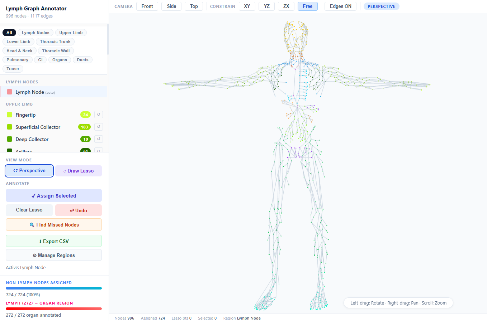

# organwise-lymph-node-annotation

An interactive web tool for annotating graph-based human lymphatic systems by organ. Load a graph defined by a vertices CSV and an edges CSV, then interactively assign nodes to organ regions using a lasso tool — no server, no install required.



---

## Features

- **3D WebGL viewport** — powered by Three.js; rotate, pan, and zoom through the full graph
- **Lasso annotation** — draw a freehand polygon on screen to select and assign nodes to a region
- **40+ built-in anatomical regions** organised into groups (Upper Limb, Lower Limb, Head & Neck, Thoracic Wall, Pulmonary, GI, Organs, Ducts, Tracer)
- **Region Manager** — add, rename, recolour, or remove regions at runtime
- **Missed-nodes finder** — detects unassigned clusters via connected-component analysis and lets you jump to them
- **Dual progress bars** — tracks assignment progress separately for non-lymph nodes and lymph nodes
- **Undo** — step back through annotation history
- **Optional pre-load** — supply an existing annotations CSV to resume a previous session
- **Export CSV** — download `annotations.csv` with `node_number`, `is_lymph_node`, and `region` columns
- **Camera controls** — Front / Side / Top presets plus free rotation, with XY / YZ / ZX axis constraints
- **Focus ring** — click a region in the sidebar to fly the camera to it and highlight it with an animated ring
- **Edge toggle** — show or hide graph edges for a cleaner view

---

## Getting Started

1. **Open** `lymphatic_system_annotator.html` in any browser (Chrome, Firefox, Edge, Safari).  
   No build step or server is needed.

2. **Load your data** on the upload screen:

   | File | Required | Format |
   |------|----------|--------|
   | **Vertices** (`.txt` / `.csv`) | Yes | Space or comma-separated `X Y Z isLymphNode`, `#` comment lines ignored |
   | **Edges** (`.txt` / `.csv`) | Yes | Space or comma-separated `From To Length(mm)`, 1-based indices, `#` comment lines ignored |
   | **Annotations** (`.csv`) | Optional | One-hot encoded: `node_number` + one column per region — pre-fills labels from a previous session |

3. Click **Load & Build Graph**.

---

## Input File Format

### Vertices file (`.txt` or `.csv`)

Space-separated or comma-separated. Lines beginning with `#` are treated as comments.

```
# X      Y      Z    isLymphNode
-131.133 -216.482 11.4885 0
-140.924 -218.734 15.4289 0
-163.842 -216.184  9.8168 1
...
```

| Column | Description |
|--------|-------------|
| `X Y Z` | 3D coordinates of the node |
| `isLymphNode` | `1` = lymph node, `0` = non-lymph node |

`isLymphNode = 1` nodes are auto-assigned to the *Lymph Node* region on load.

### Edges file (`.txt` or `.csv`)

Space-separated or comma-separated. Lines beginning with `#` are treated as comments.

```
# From To Length(mm)
1 5 18.1243
2 5 19.5585
3 6 63.1887
...
```

| Column | Description |
|--------|-------------|
| `From` | Index of the source node (1-based) |
| `To` | Index of the target node (1-based) |
| `Length(mm)` | Edge length in millimetres (loaded but not used for annotation) |

### Annotations CSV (optional pre-load)

One-hot encoded — one column per region, with `1` marking the region the node belongs to.

```
node_number,lymph_node,upper_limb_fingertip,upper_limb_axillary,...,venous_angle_lr
1,0,0,0,...,0
2,0,0,1,...,0
...
```

| Column | Description |
|--------|-------------|
| `node_number` | 1-based node index |
| *(region columns)* | One column per region; `1` = node belongs to that region, `0` = it does not |

- Column names must match region `id`s in the tool (see Built-in Anatomical Regions below).
- Used to resume a previous session or pre-fill labels from an external source.

---

## Workflow

1. **Select a region** from the sidebar list.
2. Switch to **Draw Lasso** mode (sidebar button or toolbar badge).
3. **Click and drag** on the canvas to draw a closed polygon around the nodes you want to assign.
4. Click **Assign Selected** to label those nodes.
5. Use **Undo** to revert the last assignment, or the per-region **reset button** (↺) to clear a whole region.
6. Use **Find Missed Nodes** to locate unassigned clusters; click any row to fly the camera there.
7. When finished, click **Export CSV** to download `annotations.csv`.

---

## Controls

| Action | Input |
|--------|-------|
| Rotate | Left-drag |
| Pan | Right-drag |
| Zoom | Scroll wheel |
| Draw lasso point | Click (in lasso mode) |
| Close & select lasso | Double-click or click near start |
| Focus region | Click region name in sidebar |
| Clear focus | Click the focused region again, or left-drag canvas |

---

## Built-in Anatomical Regions

| Group | Regions |
|-------|---------|
| **Lymph** | Lymph Node |
| **Upper Limb** | Axillary, Deltopectoral, Epitrochlear, Radial, Ulnar, Interosseous, Palmar |
| **Lower Limb** | Inguinal (superficial & deep), Popliteal, Dorsal Pedis, Medial, Lateral, Peroneal, Tibial, Lumbar Region |
| **Head & Neck** | Scalp, Superficial Cervical, Deep Cervical, Jugular Trunk |
| **Thoracic Wall** | Parasternal, Diaphragmatic |
| **Pulmonary** | Bronchomediastinal, Lung Parenchyma |
| **GI** | Mesenteric Collector, Digestive System |
| **Organs** | Hepatic Interstitium, Renal Interstitium, Spleen |
| **Ducts** | Cisterna Chyli, Thoracic Duct Segment, Right Lymphatic Duct, Venous Angle L/R |
| **Tracer** | Tracer Injection |

Custom regions can be added via **⚙ Manage Regions**.

---

## Dependencies

All dependencies are loaded from CDN at runtime — no `npm install` required.

- [Three.js r128](https://threejs.org/) — 3D rendering

---

## Browser Compatibility

Requires WebGL 1.0 support. Works in all evergreen desktop browsers (Chrome 90+, Firefox 88+, Edge 90+, Safari 15+).
